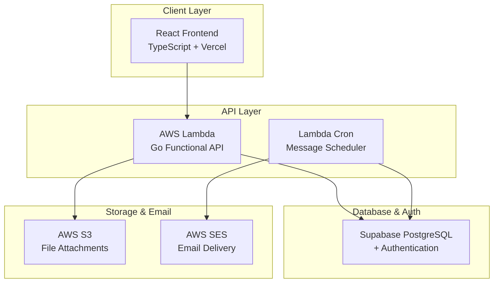

# Dear Future - System Architecture Documentation

## Executive Summary

This document outlines the complete system architecture for the "Dear Future" web application - a message scheduling system that allows users to send messages to their future selves. The architecture is designed to be ultra-cost-effective (starting at $0-5/month), migration-ready, and follows functional programming principles.

## Final Architecture Decisions

### Technology Stack
- **Frontend**: React (TypeScript) hosted on Vercel/Netlify (Free)
- **Backend**: Go with functional programming patterns
- **Database**: Supabase PostgreSQL (Free tier)
- **Authentication**: Supabase Auth with Google OAuth + Email/Password
- **Storage**: AWS S3 (Free tier)
- **Email**: AWS SES (Free tier)
- **Deployment**: AWS Lambda (serverless, pay-per-use)
- **Migration Path**: Lambda → ECS → AKS when scaling needed

### System Architecture Overview



## Functional Programming Architecture

### Core Principles
1. **Pure Functions**: Business logic with no side effects
2. **Immutable Data**: Value objects that cannot be modified
3. **Function Composition**: Building complex operations from simple functions
4. **Side Effect Isolation**: All I/O operations contained in specific boundaries

### Domain-Driven Structure
```
pkg/
├── domain/              # Pure business logic
│   ├── user/           # User domain
│   ├── message/        # Message domain
│   └── common/         # Shared functional utilities
├── effects/            # Side effects boundary
├── handlers/           # HTTP layer (thin)
└── composition/        # Dependency injection
```

## Database Schema

### Core Tables
```sql
-- User profiles (extends Supabase auth.users)
CREATE TABLE public.user_profiles (
    id UUID REFERENCES auth.users(id) PRIMARY KEY,
    email TEXT NOT NULL,
    full_name TEXT,
    default_timezone TEXT DEFAULT 'UTC',
    created_at TIMESTAMP WITH TIME ZONE DEFAULT NOW()
);

-- Messages
CREATE TABLE public.messages (
    id UUID DEFAULT gen_random_uuid() PRIMARY KEY,
    user_id UUID REFERENCES auth.users(id) NOT NULL,
    title TEXT NOT NULL,
    content TEXT NOT NULL,
    delivery_date TIMESTAMP WITH TIME ZONE NOT NULL,
    status TEXT DEFAULT 'scheduled',
    created_at TIMESTAMP WITH TIME ZONE DEFAULT NOW(),
    delivered_at TIMESTAMP WITH TIME ZONE
);

-- File attachments
CREATE TABLE public.message_attachments (
    id UUID DEFAULT gen_random_uuid() PRIMARY KEY,
    message_id UUID REFERENCES public.messages(id) ON DELETE CASCADE,
    file_name TEXT NOT NULL,
    storage_path TEXT NOT NULL,
    uploaded_at TIMESTAMP WITH TIME ZONE DEFAULT NOW()
);
```

## Migration Strategy

### Deployment Evolution
1. **Phase 1**: Lambda (Start here - $0-5/month)
2. **Phase 2**: ECS Fargate (Scale up - $30-50/month)
3. **Phase 3**: AKS/EKS (Enterprise - $100+/month)

### Migration Triggers
- **Lambda → ECS**: When monthly costs exceed $20 or cold starts become problematic
- **ECS → Kubernetes**: When traffic exceeds 100K+ users or need advanced orchestration

### Code Portability
The functional architecture ensures the same codebase works across all deployment targets:
- Dual entry points (Lambda + Standard HTTP)
- Environment-agnostic configuration
- Side effects isolated to interfaces
- Multi-stage Docker builds

## Cost Analysis

### Current Costs (Lambda Deployment)
- **Supabase**: $0 (free tier: 500MB DB)
- **AWS Lambda**: $0-2 (1M requests free)
- **AWS S3**: $0-1 (5GB free tier)
- **AWS SES**: $0-1 (62K emails free)
- **Vercel**: $0 (free hosting)
- **Total**: $0-5/month

### Migration Cost Comparison
| Platform | Monthly Cost | Users Supported | Migration Complexity |
|----------|--------------|-----------------|---------------------|
| Lambda   | $0-5        | 1K-10K         | Current            |
| ECS      | $30-50      | 10K-100K       | Medium             |
| AKS      | $100-300    | 100K+          | High               |

## Security Considerations

### Authentication & Authorization
- Supabase Auth with JWT tokens
- Google OAuth + Email/Password options
- Row Level Security (RLS) policies
- Automatic user data isolation

### Data Protection
- Database encryption at rest
- S3 bucket encryption
- HTTPS/TLS for all communications
- Secure file upload with size limits

### Infrastructure Security
- Lambda runs in secure AWS environment
- No persistent servers to maintain
- Automatic security updates
- Minimal attack surface

## Development Timeline

### Phase 1: MVP Development (4-6 weeks)
1. **Week 1-2**: Go API with functional architecture + Supabase setup
2. **Week 3-4**: React frontend + Authentication integration
3. **Week 5-6**: Message scheduling + Email delivery + Testing

### Phase 2: Production Deployment (1-2 weeks)
1. **Week 1**: AWS Lambda deployment + CI/CD setup
2. **Week 2**: Security hardening + Monitoring + Go-live

### Total: 6-8 weeks for complete system

## API Specification

### Authentication Endpoints
- `POST /auth/register` - Email/password registration
- `POST /auth/login` - Login (email/password or Google)
- `GET /auth/me` - Get current user
- `POST /auth/refresh` - Refresh JWT token

### Message Endpoints
- `GET /api/v1/messages` - List user messages (paginated)
- `POST /api/v1/messages` - Create new message
- `GET /api/v1/messages/{id}` - Get specific message
- `PUT /api/v1/messages/{id}` - Update message (if not delivered)
- `DELETE /api/v1/messages/{id}` - Delete message

### File Management
- `POST /api/v1/messages/{id}/attachments` - Upload file
- `GET /api/v1/attachments/{id}/download` - Download file (signed URL)

## Key Architectural Benefits

### Ultra-Low Cost
- Start with $0-5/month operational costs
- Pay-per-use model scales with growth
- No upfront infrastructure investment

### Migration-Ready
- Same codebase works on Lambda, ECS, and Kubernetes
- Functional architecture prevents vendor lock-in
- Clear upgrade path as requirements change

### Functional Programming Advantages
- **Testability**: Pure functions are easy to unit test
- **Maintainability**: Immutable data prevents bugs
- **Scalability**: No shared state, easy parallelization
- **Reliability**: Predictable behavior, no side effects

### Development Efficiency
- Rapid prototyping with serverless
- Strong type safety with Go
- Comprehensive testing strategy
- Clear separation of concerns

## Risk Mitigation

### Technical Risks
- **Lambda Cold Starts**: Acceptable for low-traffic start, migrate to ECS if needed
- **Vendor Lock-in**: Functional architecture enables easy migration
- **Scaling Limits**: Clear upgrade path defined

### Business Risks
- **Cost Overruns**: Pay-per-use model prevents unexpected bills
- **Data Loss**: Automated backups with Supabase
- **Security Breaches**: Multiple layers of security, minimal attack surface

## Conclusion

This architecture provides an optimal balance of:
- **Ultra-low starting costs** ($0-5/month)
- **Professional scalability** (clear migration path)
- **Modern development practices** (functional programming)
- **Operational simplicity** (serverless, managed services)

The functional programming approach ensures code quality and maintainability, while the migration-ready design prevents technical debt as the application grows.